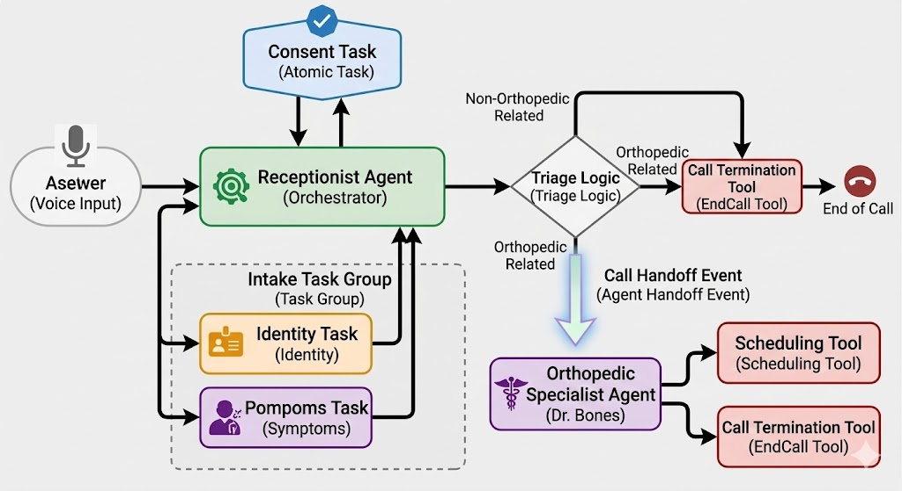

# 🏥 Medical AI Triage System (Multi-Agent Workflow)

A production-grade, voice-first AI Triage system built with **LiveKit Agents**. This project orchestrates a complex medical intake process using a multi-agent architecture, automated task groups, and a robust evaluation suite.



## 🚀 Key Features

* **Multi-Agent Orchestration**: Seamlessly transitions from a **Receptionist Agent** to a **Specialist Agent** (e.g., Orthopedics) while preserving complete conversation context.

* **Structured Data Extraction**: Utilizes **Task Groups** to collect patient identity and symptoms with built-in support for user corrections (Regression).

* **Medical Compliance**: Enforces a mandatory **Consent Task** before processing any sensitive medical information.

* **Autonomous Tool Usage**: Agents can schedule appointments in external databases and gracefully end calls using prebuilt and custom tools.

* **Automated Testing Suite**: Comprehensive unit and integration tests using **LLM-based judgment** to evaluate intent, tone, and logic.

---

## 🏗️ Architecture & Best Practices

This project strictly follows the **LiveKit Workflows** best practices to ensure reliability and maintainability.

### 1. Separation of Concerns (Agents vs. Tasks)

* **Agents**: Handle long-lived conversation control and strategic reasoning.

* **Tasks**: Discrete, short-lived units of work (e.g., collecting an age) that return typed results to the orchestrator.

* **Task Groups**: Coordinate multi-step ordered flows like patient intake, ensuring data integrity.

### 2. Advanced Prompt Engineering

Instructions are isolated in **Markdown files** (`/prompts`) for better version control and readability. We apply:

* **Identity & Goal Setting**: Clear role definitions to improve prompt adherence.

* **Output Formatting Rules**: Strict rules to optimize for Text-to-Speech (TTS) by avoiding complex formatting and emojis.

* **Guardrails**: Safety constraints to prevent the AI from providing medical diagnoses or prescriptions.

### 3. Context Management

When a **Handoff** occurs, the new agent is injected with dynamic patient context (Name, Symptoms, Severity) to avoid redundant questions and provide a personalized experience.

---

## 📂 Project Structure

```text
📁 medical-ai-triage/
├── 📁 agents/          # Multi-agent logic & handoff orchestration
├── 📁 tasks/           # Atomic, short-lived units of work (Consent, Identity, etc.)
├── 📁 tools/           # External service integrations (Scheduling, EndCall)
├── 📁 models/          # Typed data schemas (Dataclasses) for validation
├── 📁 prompts/         # Instructions in Markdown (Separated from Logic)
├── 📁 tests/           # Behavioral & Integration test suite
├── 📁 utils/           # Shared helper functions (Dynamic prompt loading)
└── 📁 custom_plugin/    # Proprietary TTS integration (XTTS)

```

---

## 🧪 Testing Strategy

Testing is a core component of this project to ensure production readiness.

* **Behavioral Tests**: Validating that the agent responds with the correct intent for typical use cases.
* **Tool Validation**: Ensuring functions are called with accurate arguments (e.g., correct age/name extraction).
* **LLM-based Judgment**: Using a "Judge LLM" to qualitatively evaluate if the assistant's message fulfills the intended goal.
* **Integration Tests**: Simulating multiple conversation turns to verify state transitions between tasks and agents.

---

## 🛠️ Technology Stack

* **Orchestration**: LiveKit Agents Framework.
* **LLM**: Qwen 235B (via Scaleway) for high-reasoning triage logic.
* **STT**: Voxtral Small (via Scaleway) for low-latency speech recognition.
* **TTS**: Custom XTTS implementation for natural, clinical voice output.
* **Testing**: Pytest & Pytest-asyncio.
* **Environment**: Python 3.12 with `uv` for lightning-fast dependency management.

---

## ⚙️ Setup & Installation

1. **Environment Variables**: Create a `.env.local` file with your API keys. **Never commit this file**.
2. **Install Dependencies**:

```bash
uv sync

```

3. **Run the Agent**:

```bash
uv run main.py dev

```

4. **Run Tests**:

```bash
uv run pytest -v

```

---

### 📝 Conclusion

This project demonstrates the ability to build sophisticated, safe, and testable AI voice systems. By leveraging **Multi-Agent Handoffs** and **TaskGroups**, it solves the "monolithic prompt" problem, creating a scalable solution for healthcare automation.
